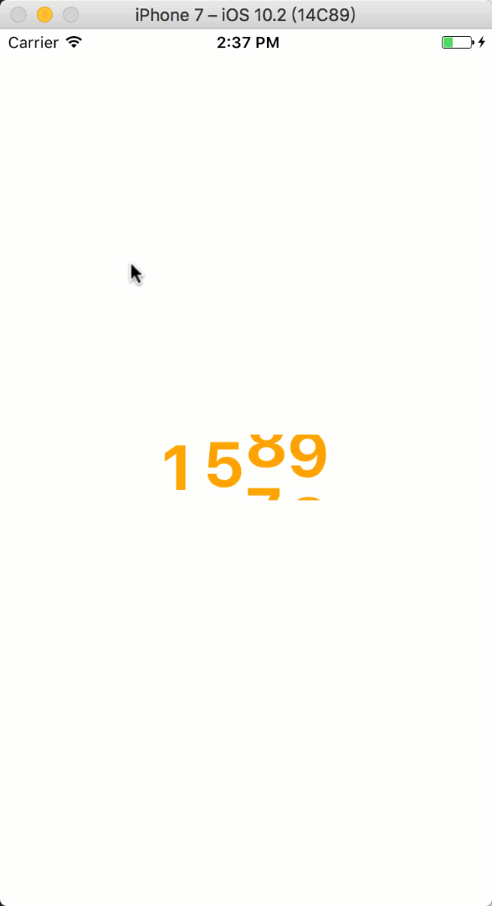

## 训练4

学习视频，然后完成下列动画和组件开发训练。


### 训练1 —— 数字动画

在很多前端应用中会有数字动画，参考效果如下：




参考上述效果实现一个动画数字组件。

名称：AnimatedNumber

属性清单:

1. number|String 动画数字
2. fontStyle|Object 字体样式
3. duration|number 最短动画时长。
4. gap|number 每一个数字递增的动画时长。

如gif中的组件应该有如下属性：

``` javascript
<AnimatedNumber
  number="1234"
  fontStyle={{color : 'orange', fontSize : 48, fontWeight : 'bold'}}
  duration={600}
  gap={500}
/>
```

比如说上面的配置， 数字1动画播放时间为600ms，数字2播放时间为1100ms， 数字3播放时间为1600ms，数字4播放时间为2100ms。 所以gap代表了递增的动画时间。

实现提示：
1. 定义一个自定义组件放在AnimatedNumber.js中
2. 属性类型验证可以参考 [React属性类型校验](https://facebook.github.io/react/docs/typechecking-with-proptypes.html) **暂无中文文档** 可以使用翻译工具或词典
3. 为了简化实现可以考虑写一个播放一个数字的子组件， 如： ANumber。 而AnimatedNumber是ANumber组件的组合。
 
